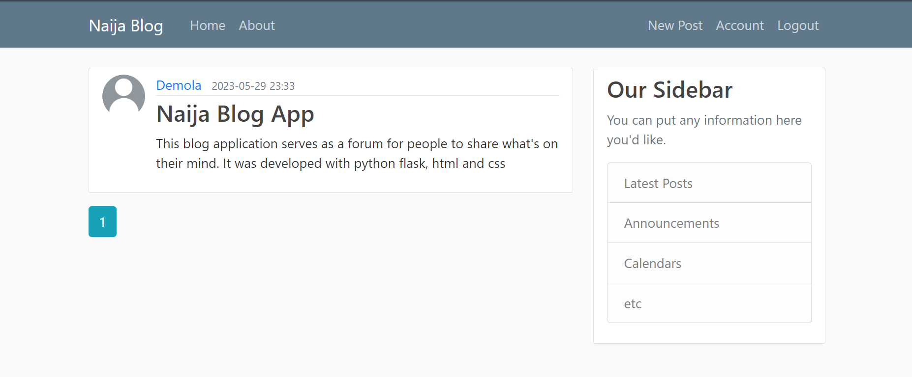
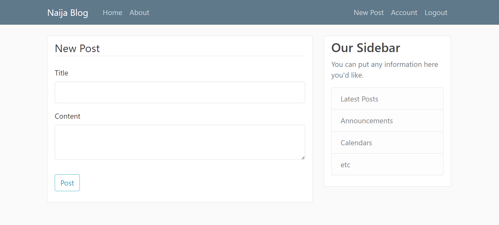

# Naija Blog

 
 

<table>
  <tr>
    <td></td>
    <td></td>
  </tr>
</table>
 

 

<b>Naijablog - A social blog web app</b>

 

## ➡️ Description
This is a simple social blog web app built with html, css and python using the web development framework Flask. 
Built this app while learning Web development using python flask. 

## ➡️ Features
* View posts on the app
* View posts made by a particular user
* Register user for an account
* Log in into account
* Update account profile information
* Create, edit or delete posts as an authenticated user
* Reset account password
* Log out from account
  

## ➡️ Languages | Technologies
<table>
  <tr>
    <td>Programming Languages</td>
    <td>Python</td>
  </tr>
  <tr>
    <td>Backend</td>
    <td>Flask</td>
  </tr>
  <tr>
    <td>Frontend</td>
    <td>HTML, CSS, Bootstrap</td>
  </tr>
  <tr>
    <td>Database</td>
    <td>Sqlite3</td>
  </tr>
</table>
 

## ➡️ Installation
* Clone or download this repository
* Ensure python is installed on your system
* Create virtual environment in parent directory, run `python -m venv venv`
* Activate environment, for bash run `source venv/Scripts/activate`
* Install project packages, run `pip install -r requirements.txt`
* Create a .env file and set values for **SECRET_KEY**, **MAIL_USERNAME** AND **MAIL_PASSWORD**
* Navigate to naijablog/ directory and run `python Run.py`
 

## ➡️ Contribution/Improvement
* To improve on this, provision could be made to comment under each post